# MercadoLibre_Financial_Analysis

## Overview
 With over 200 million users, MercadoLibre is the most popular e-commerce site in Latin America. As an analyst at [MercadoLibre](http://investor.mercadolibre.com/investor-relations). one is tasked with analyzing the company's financial and user data to make the company grow. So, this analysis is target to find out if the ability to predict search traffic can translate into the ability to successfully trade the stock and financial budget. 

 To do so, the analyses are including the followings:
* 1: Find unusual patterns in hourly Google search traffic - Data Science Team

* 2: Mine the search traffic data for seasonality - Marketing Team

* 3: Relate the search traffic to stock price patterns - Finance Team

* 4: Create a time series model with Prophet - Data Science Team

* 5: Forecast revenue by using time series models - Finance Team


## Results: 
### 1 - Find Unusual Patterns in Hourly Google Search Traffic

To discover if Google search traffic for the company links to any financial events at the company. Or, does the search traffic data just present random noise? To answer this question, pick out any unusual patterns in the Google search data for the company, and connect them to the corporate financial events.

- Read the search data into a DataFrame, and then slice the data to just the month of May 2020. During this month, MercadoLibre released its quarterly financial results.
    ```
    df_mercado_trends = pd.read_csv("google_hourly_search_trends.csv",
                                    index_col = "Date",
                                    parse_dates = True,
                                    infer_datetime_format = True)

    ```
- Use hvPlot to visualize the results. Detect if there is any unusual patterns exist.
    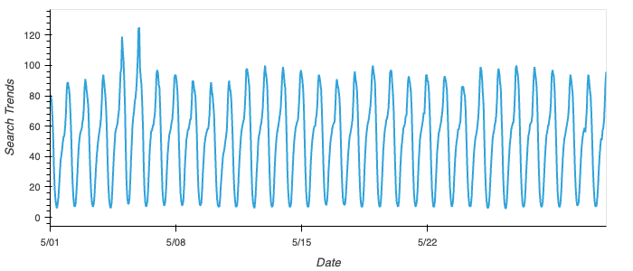

- Calculate the total search traffic for the month(May 2020), and then compare the value to the monthly median across all months. 

    traffic_may_2020/median_monthly_traffic = 1.085536

- Insights: 
    > Did the Google search traffic increase during the month that MercadoLibre released its financial results?

        1. Some unusual spikes are shown in the graph. At the beginning of May (around 5/5 and 5/6), The company got more searches. This the time when MercadoLibre released its quarterly financial results. It suggests that the higher traffic days in this month were generated by increased investor interest.
        2. The total search traffic for 2020-05 was also 8.5% higher than the overall median monthly traffic for the company.


### 2 - Mine the Search Traffic Data for Seasonality

Search data is potentially helpful for Marketing team, too. If they can track and predict interest in the company and its platform for any time of day, they can focus their marketing efforts around the times that have the most traffic. This will get a greater return on investment (ROI) from their marketing budget.

- Group the hourly search data to plot the average traffic by the day of the week.
    ```
    weekly_traffic = df_mercado_trends.groupby(df_mercado_trends.index.dayofweek).mean()
    ```
    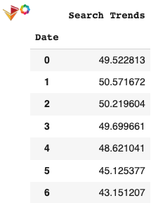
    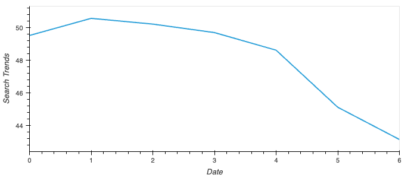

- Using hvPlot, visualize this traffic as a heatmap, referencing the `index.hour` as the x-axis and the `index.dayofweek` as the y-axis. 
    ```
    df_mercado_trends.hvplot.heatmap(x='index.hour', y='index.dayofweek', C='Search Trends', reduce_function=np.mean, cmap='reds', colorbar=True)
    ```
    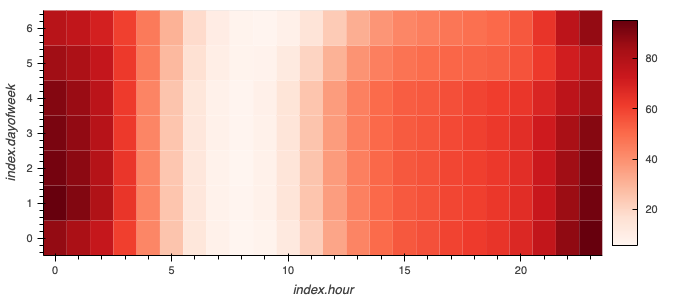

- Group the search data by the week of the year. 
    ```
    yearly_traffic = df_mercado_trends.groupby(df_mercado_trends.index.week).mean()
    ```
    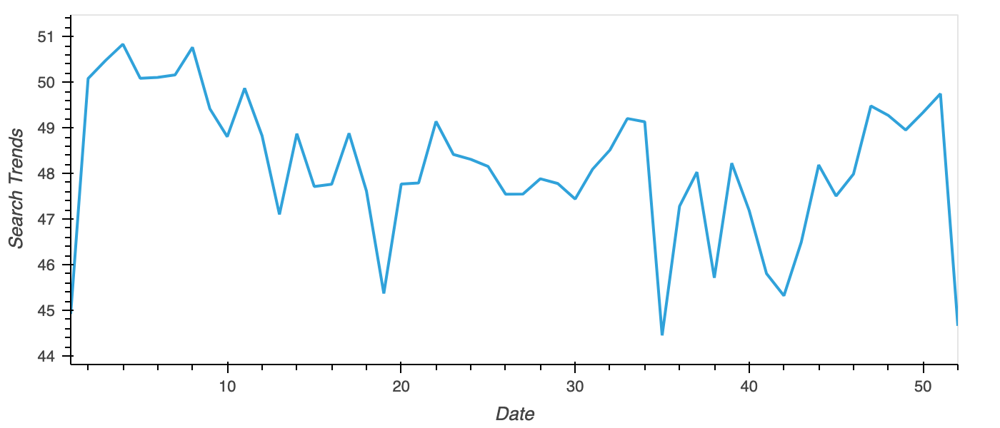

- Insights:
    >   Does any day-of-week effect that you observe concentrate in just a few hours of that day?

        1. Most traffic are on Monday through Thursday. Friday and Saturday's seache traffics slows down. 
        2. Overall, people are less interested in searching in the morning, which shown by the cooler region. Searches increase in the afternoon and evenings, especially late evenings.
        3. Compare to weekdays, searches on weekend is shifted by one or two hours earlier. People may go for early online shopping.

    >   Does the search traffic tend to increase during the winter holiday period (weeks 40 through 52)?

        1. During the winter holiday (weeks 40 through 52), search traffic tends to increase since week 41 (mid-October). People started holiday shopping to prepare for Christmas and New Year. 
        2. However, week 51 reaches to the peak of the pattern. The following week 52 is the end of year. People unlikely shopping during this time, may enjoying their holiday with families and friends.
        3. The search gets back to normal or get even higher at the begining of the year. This may caused by increased shopping for new year or lured by big discount for holiday clearance.  


### 3 - Relate the Search Traffic to Stock Price Patterns

Discover if any relationship between the search data and the company stock price exists for finance group. 

To do so, complete the following steps:

- Read in and plot the stock price data. Concatenate the stock price data to the search data in a single DataFrame.
    ```
    df_mercado_stock = pd.read_csv("mercado_stock_price.csv",index_col="date",parse_dates=True,infer_datetime_format=True)
    ```
    ```
    mercado_stock_trends_df = pd.concat([df_mercado_stock,df_mercado_trends], axis=1).dropna()
    ```

    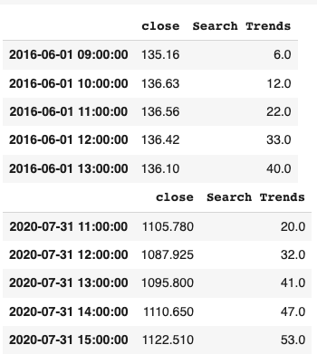
    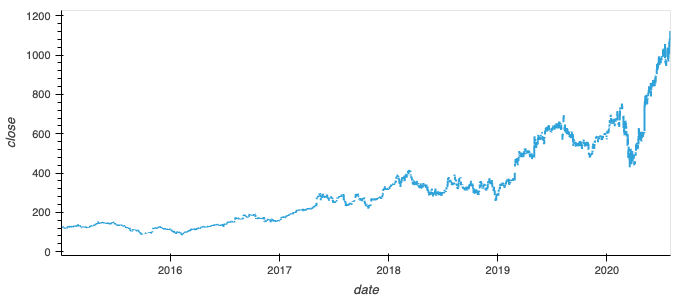

- Market events emerged during the year of 2020 that many companies found difficult. But, after the initial shock to global financial markets, new customers and revenue increased for e-commerce platforms. Slice the data to just the first half of 2020 (`2020-01` to `2020-06` in the DataFrame), and then use hvPlot to plot the data. 
    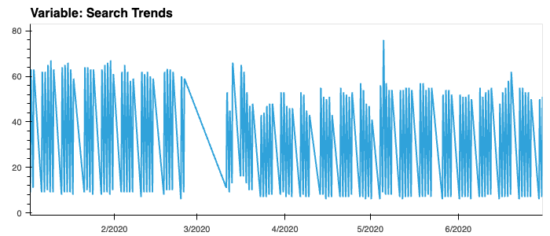
    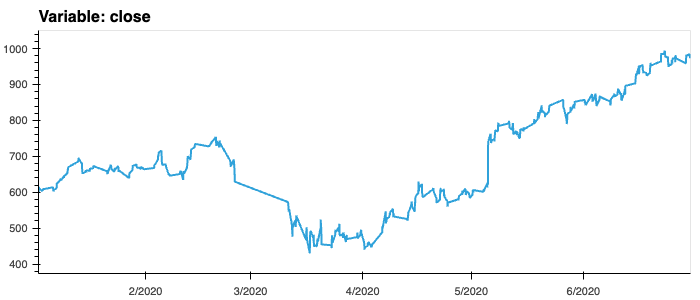


- Insights:
    > Do both time series indicate a common trend that’s consistent with this narrative?
     
        1. In fact, the evidence of a common trend between search activity and stock price is pretty limited. However, for the lowest points of stock price, which appears in late March through early April, did coincide with the lower search activities.
        2. Searches turned more activate later, brought up the stock price since late April. The stock price keep onwarding, the search activities remained stable.
        3. There is spike on search pattern in May-05-2020, almost at the same time, stock price had a steep slope growth. This time aligned with the date of company's quarterly report release to the public. The peak of searching was a couple of hours later than the stock price spike. This might indicate that the Google search pattern can predict the stock price. An alternative explanation might be that people just search for more information about the company before its earnings release announcement. For this hypothesis, we need to do more time series analysis to see which explanation best fits the data.

-  Create a new column in the DataFrame named “Lagged Search Trends” that offsets, or shifts, the search traffic by one hour. Create two additional columns:

    
    **Hourly Stock Return** holds the percent change of the company's stock price on an hourly basis
    **Stock Volatility** holds an exponentially weighted four-hour rolling average of the company’s stock volatility

    ```
    mercado_stock_trends_df['Lagged Search Trends'] = mercado_stock_trends_df['Search Trends'].shift(1)
    mercado_stock_trends_df['Hourly Stock Return'] = mercado_stock_trends_df['close'].pct_change()
    mercado_stock_trends_df['Stock Volatility'] = mercado_stock_trends_df['close'].pct_change().rolling(window=4).std()
    ```
    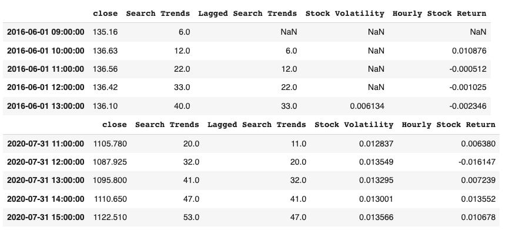

- Review the time series correlation to discover the relationship between variables.
    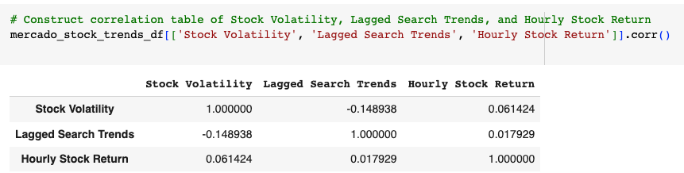

- Insights:
    > Does a predictable relationship exist between the lagged search traffic and the stock volatility or between the lagged search traffic and the stock price returns?

        1. There is a slightly negative correlation between searches for the company and its subsequent stock volatility (-0.148938). More searches tend to indicate less near-term hourly stock risk for the company.
        2. There is positive correlation between search activity in an hour and stock returns in the next. As search activity goes up, stock return goes up in the next hour. But this correlation(0.017929) is very weak though. It might be chances that it is random. Search trends is hard to predict the market.

### 4 - Create a Time Series Model with Prophet

Produce a time series model that analyzes and forecasts patterns in the hourly search data. 

- Set up the Google search data for a Prophet forecasting model.
    ```
    mercado_prophet_df = df_mercado_trends.reset_index()
    mercado_prophet_df.columns=['ds','y']
    mercado_prophet_df = mercado_prophet_df.dropna()
    ```

- Create Prophet model, plot the forecast. 
    ```
    model_mercado_trends = Prophet()
    model_mercado_trends.fit(mercado_prophet_df)
    future_mercado_trends = model_mercado_trends.make_future_dataframe(periods=2000, freq='H') 
    forecast_mercado_trends = model_mercado_trends.predict(future_mercado_trends)
    ```
    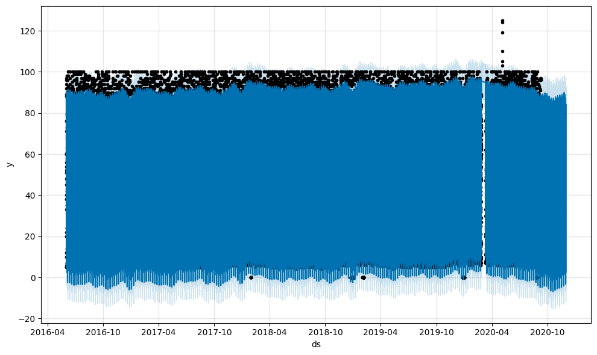


- Plot the individual time series components of the model to reveal the patterns.
    ```
    forecast_mercado_trends[['yhat', 'yhat_lower', 'yhat_upper']].iloc[-2000:,:].hvplot()
    model_mercado_trends.plot_components(forecast_mercado_trends)
    ```
    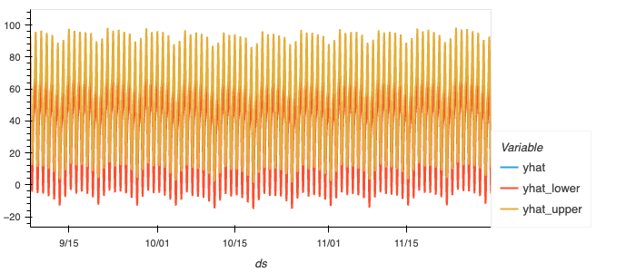
    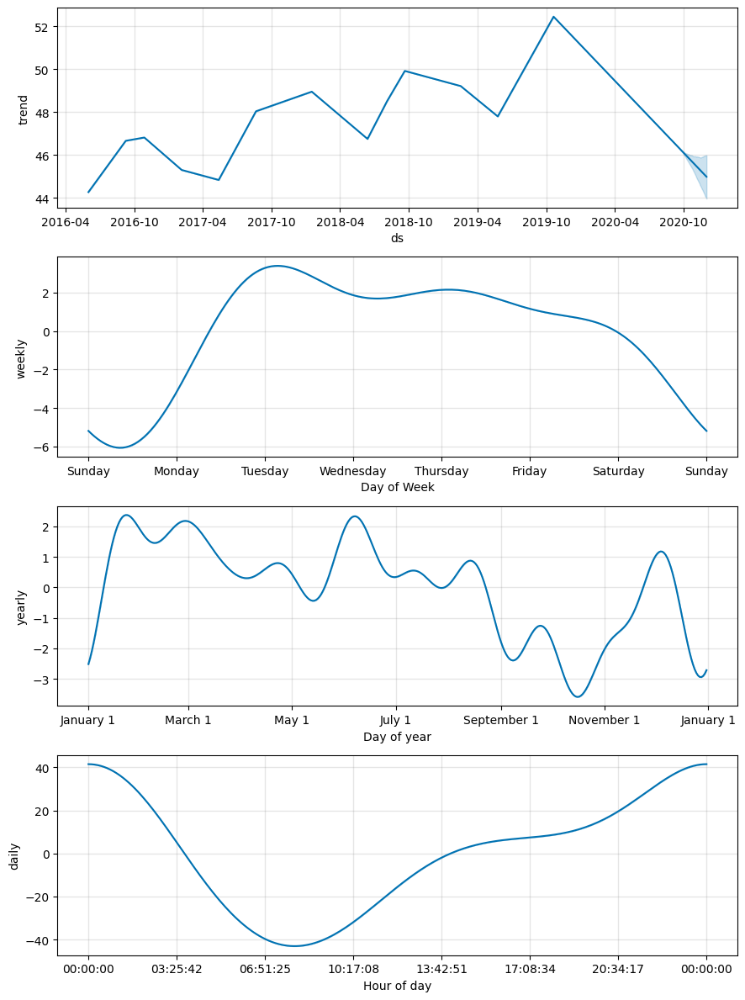

- Insights:
    > How's the near-term forecast for the popularity of MercadoLibre?

        Near-term forecast shows that the popularity of MercadoLibre will level off through the rest of 2020. Predicted data starts from the beginning of September 2020, the average of search activity will be around 85. Lower than historical average data roughly about 90.
    
    > What time of day exhibits the greatest popularity?

        In the late evenings (20:00 - 3:00) tends to be the peak of searching popularity.

    > Which day of the week gets the most search traffic?

        Tuesday through Thursday get higher search traffic, Tuesday is the most busy day throughout across the week.

    > What's the lowest point for search traffic in the calendar year?

        In the middle of October, the last week of the year and the first week of the year , search traffic get the lowest periods. The October low could be a holiday effect.


### 5 - Forecast Revenue by Using Time Series Models

With sales data, it is possible to make a forecast of the total sales for the next quarter for the finance team need. This will dramatically increase their ability to plan budgets and to help guide expectations for the company investors.


- Read in the daily historical sales (that is, revenue) figures, and then apply a Prophet model to the data.
    ```
    df_mercado_sales = pd.read_csv("mercado_daily_revenue.csv",index_col='date',parse_dates=True,infer_datetime_format=True)
    ```
    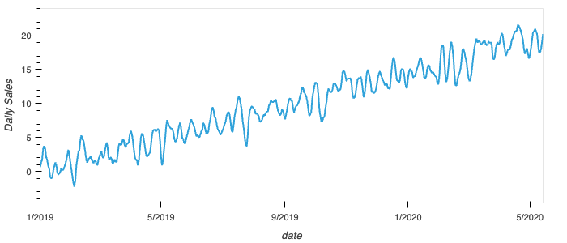
    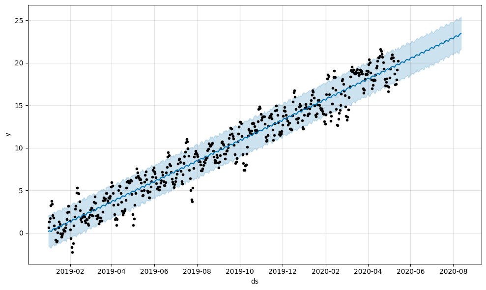

- Interpret the model output to identify any seasonal patterns in the company's revenue. For example, what are the peak revenue days? (Mondays? Fridays? Something else?)
    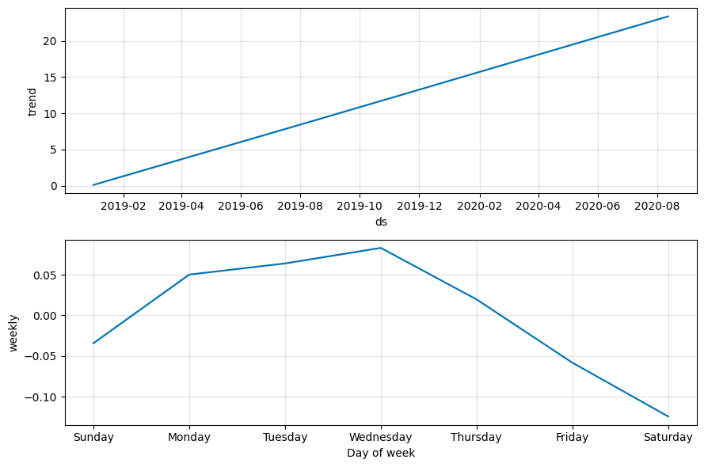

- Produce a sales forecast for the finance group. 
    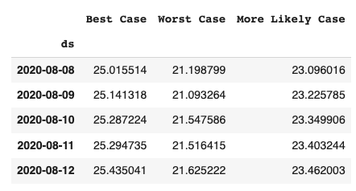
    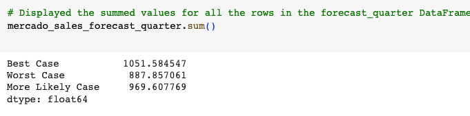

- Insights:
    > How much will be the expected total sales in the next quarter? What's the suggestion for finance team to help them make better plans? 
        
        The total sales next quarter is expected between  $888−1052 Million. Most likely to be $970 Million. That means if the finance team doesn't want to raise debt next quarter, they can make sure expenditures next quarter don't outpace the amount of revenue anticipated under the worst case 888 million USD. This would ensure that revenue received is sufficient to cover costs, without having to seek outside financing.
        
### Summary
    1. Google search traffic for MercadoLibre on May 5th and May 6th 2020 shows a unusal peak. The monthly search traffic for May 2020 is higher than the overall median monthly search traffic. This time align with the date Mercado released its financial results. It is suggested that  company's dynamics affect the public search interests.
    2. Search traffic mainly focused on late evenings. Weekend searches are shifted by one or two hours earlier than weekdays. This indicates that people are inclined to do online shopping in the evenings and slightly earlier on weekend mornings.
    3. Once the holiday season is approaching, people are preparing goods for the holidays. Search trends goes upward from mid-October (week 40-51). The last week right before New Year and the first week right after New Year, search traffic freezes. Probably no buyings is needed at this time. Big wave of onling shopping comes back after the first week of New Year.
    4. Overall, the stock price is not proportionate to the increased google search traffic for the company. But the lowest stock period in late March through early April, did coincide wtih the lower search activities. The company earnings release announcement brought the peak of search pattern. Right after that, stock price got a steep slope growth.
    5. As search activity goes up, stock return goes up in the next hour. But this could be an accidental phenomena since the correlation is very weak. On the other hand, more searches tend to indicate more stable stock price in near-term hours.
    6. Near-term forecast for the search popularity of MercadoLiber will be around 85, which is lower than average popularity 90. Late evenings tends to be the peak of search activities. Tuesday is the most busy day of the website. In the middle of October and around New Year, it is reaches to the lowest point of searching activities. Maybe people tends to wait for the last minute for the big sales.
    7. THe total sales in next quarter is expected between 888-1051 million USD. Most likely to be $970 Million. The forecast provides the information for finance group to better make their budget.

